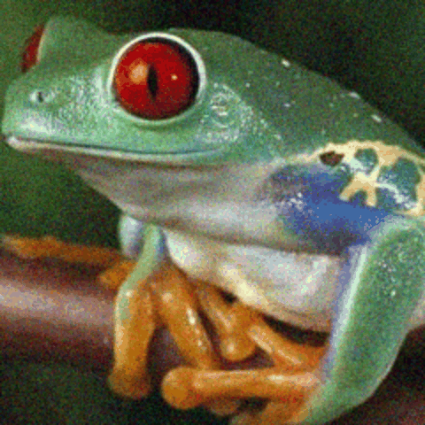
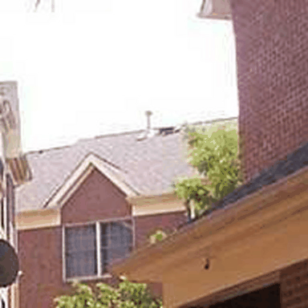
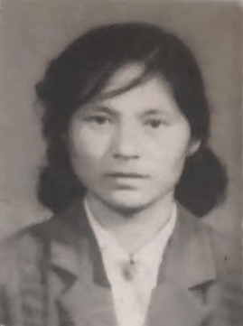
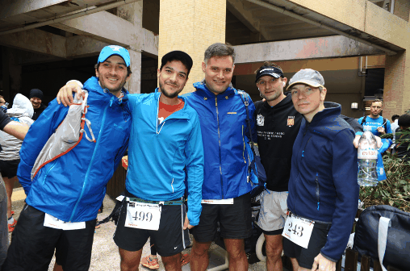

# Pixel-Aware Stable Diffusion for Realistic Image Super-Resolution and Personalized Stylization

[Paper](https://arxiv.org/abs/2308.14469)

[Tao Yang](https://cg.cs.tsinghua.edu.cn/people/~tyang)<sup>1</sup>, Peiran Ren<sup>1</sup>, Xuansong Xie<sup>1</sup>, [Lei Zhang](https://www4.comp.polyu.edu.hk/~cslzhang)<sup>2</sup>  
_<sup>1</sup>[DAMO Academy, Alibaba Group](https://damo.alibaba.com), Hangzhou, China_  
_<sup>2</sup>[Department of Computing, The Hong Kong Polytechnic University](http://www.comp.polyu.edu.hk), Hong Kong, China_

## Our model can do various tasks. Hope you can enjoy it.

## Realistic Image SR
 

## Old photo restoration
 

## Personalized Stylization
 

## Colorization
 

## News
(2023-10-18) Completely solved the [issues](https://github.com/yangxy/PASD/issues/16) by initializing latents with input LR images. Interestingly, the SR results also become much more stable.

(2023-10-11) [Colab demo](https://colab.research.google.com/drive/1lZ_-rSGcmreLCiRniVT973x6JLjFiC-b?usp=sharing) is now available. Credits to [Masahide Okada](https://github.com/MasahideOkada).

(2023-10-09) Add training dataset.

(2023-09-28) Add tiled latent to allow upscaling ultra high-resolution images. Please carefully set ```latent_tiled_size``` as well as ```--decoder_tiled_size``` when upscaling large images.

(2023-09-12) Add Gradio demo.

(2023-09-11) Upload pre-trained models.

(2023-09-07) Upload source codes.

## Usage
- Clone this repository:
```bash
git clone https://github.com/yangxy/PASD.git
cd PASD
```

- Download SD1.5 models from [huggingface](https://huggingface.co/runwayml/stable-diffusion-v1-5) and put them into ``checkpoints/stable-diffusion-v1-5``. 

- Prepare training datasets. Please check ``dataloader/localdataset.py`` and ``dataloader/webdataset.py`` carefully and set the paths correctly. We highly recommend to use ``dataloader/webdataset.py``.

- Download our training dataset. [DIV2K_train_HR](http://public-vigen-video.oss-cn-shanghai.aliyuncs.com/robin/data/SR_data/tars/pngtxt/DIV2K_train_HR.tar.gz?OSSAccessKeyId=LTAI4G6bfnyW4TA4wFUXTYBe&Expires=2012200038&Signature=pS4wwrAMm3wdlpU%2BxYKUsOkrgjA%3D) | [DIV8K-0](http://public-vigen-video.oss-cn-shanghai.aliyuncs.com/robin/data/SR_data/tars/pngtxt/DIV8K-0.tar.gz?OSSAccessKeyId=LTAI4G6bfnyW4TA4wFUXTYBe&Expires=2012200091&Signature=JJBUqbfNoOLnzGp9mFNDFJsUh%2Fk%3D) | [DIV8K-1](http://public-vigen-video.oss-cn-shanghai.aliyuncs.com/robin/data/SR_data/tars/pngtxt/DIV8K-1.tar.gz?OSSAccessKeyId=LTAI4G6bfnyW4TA4wFUXTYBe&Expires=2012200121&Signature=ou0ooaSaGVtMx0tFN3rZEx236s8%3D) | [DIV8K-2](http://public-vigen-video.oss-cn-shanghai.aliyuncs.com/robin/data/SR_data/tars/pngtxt/DIV8K-2.tar.gz?OSSAccessKeyId=LTAI4G6bfnyW4TA4wFUXTYBe&Expires=2012200150&Signature=5FQeeqxX%2Fzb9%2FhnwTklz8N34hKI%3D) | [DIV8K-3](http://public-vigen-video.oss-cn-shanghai.aliyuncs.com/robin/data/SR_data/tars/pngtxt/DIV8K-3.tar.gz?OSSAccessKeyId=LTAI4G6bfnyW4TA4wFUXTYBe&Expires=2012200175&Signature=h08kXBnZ9%2FTFpxU%2F5apBQvVMuic%3D) | [DIV8K-4](http://public-vigen-video.oss-cn-shanghai.aliyuncs.com/robin/data/SR_data/tars/pngtxt/DIV8K-4.tar.gz?OSSAccessKeyId=LTAI4G6bfnyW4TA4wFUXTYBe&Expires=2012200201&Signature=6wz8PREaNkykhZ%2BAZeoeGO3Jm4Y%3D) | [DIV8K-5](http://public-vigen-video.oss-cn-shanghai.aliyuncs.com/robin/data/SR_data/tars/pngtxt/DIV8K-5.tar.gz?OSSAccessKeyId=LTAI4G6bfnyW4TA4wFUXTYBe&Expires=2012200226&Signature=uCWbd2jaJsAoYFKtr7nlWQ3WiOY%3D) | [FFHQ_5K](http://public-vigen-video.oss-cn-shanghai.aliyuncs.com/robin/data/SR_data/tars/pngtxt/FFHQ_5K.tar.gz?OSSAccessKeyId=LTAI4G6bfnyW4TA4wFUXTYBe&Expires=2012200266&Signature=GBDovtNCqRR2nNz%2B4UKlmpVfJtE%3D) | [Flickr2K_HR-0](http://public-vigen-video.oss-cn-shanghai.aliyuncs.com/robin/data/SR_data/tars/pngtxt/Flickr2K_HR-0.tar.gz?OSSAccessKeyId=LTAI4G6bfnyW4TA4wFUXTYBe&Expires=2012200304&Signature=vu7uOdZdLB5uSbdBKbsBMnmnjvQ%3D) | [Flickr2K_HR-1](http://public-vigen-video.oss-cn-shanghai.aliyuncs.com/robin/data/SR_data/tars/pngtxt/Flickr2K_HR-1.tar.gz?OSSAccessKeyId=LTAI4G6bfnyW4TA4wFUXTYBe&Expires=2012200331&Signature=9ID3bgjXfR7xt5zUDfNkRG50DQc%3D) | [Flickr2K_HR-2](http://public-vigen-video.oss-cn-shanghai.aliyuncs.com/robin/data/SR_data/tars/pngtxt/Flickr2K_HR-2.tar.gz?OSSAccessKeyId=LTAI4G6bfnyW4TA4wFUXTYBe&Expires=2012200371&Signature=Zww60FOUIX%2Bysg%2FJaaM%2BvdK5ePk%3D) | [OST_animal](http://public-vigen-video.oss-cn-shanghai.aliyuncs.com/robin/data/SR_data/tars/pngtxt/OST_animal.tar.gz?OSSAccessKeyId=LTAI4G6bfnyW4TA4wFUXTYBe&Expires=2012200402&Signature=QnIJVqzwBITZW%2FNTatRxaKiyjaY%3D) | [OST_building](http://public-vigen-video.oss-cn-shanghai.aliyuncs.com/robin/data/SR_data/tars/pngtxt/OST_building.tar.gz?OSSAccessKeyId=LTAI4G6bfnyW4TA4wFUXTYBe&Expires=2012200430&Signature=W9AYnjnoftY8YF2NII6hx9Xf%2B0o%3D) | [OST_grass](http://public-vigen-video.oss-cn-shanghai.aliyuncs.com/robin/data/SR_data/tars/pngtxt/OST_grass.tar.gz?OSSAccessKeyId=LTAI4G6bfnyW4TA4wFUXTYBe&Expires=2012200460&Signature=qoy%2FNAJUxOdVqYb6CpL4gt9aYxo%3D) | [OST_mountain](http://public-vigen-video.oss-cn-shanghai.aliyuncs.com/robin/data/SR_data/tars/pngtxt/OST_mountain.tar.gz?OSSAccessKeyId=LTAI4G6bfnyW4TA4wFUXTYBe&Expires=2012200477&Signature=si3mNDvz2ZxIyoLbyuZmIOvzctE%3D) | [OST_plant](http://public-vigen-video.oss-cn-shanghai.aliyuncs.com/robin/data/SR_data/tars/pngtxt/OST_plant.tar.gz?OSSAccessKeyId=LTAI4G6bfnyW4TA4wFUXTYBe&Expires=2012200510&Signature=jz%2BZeVmeoi6Lu9CQHId6XZhyyk8%3D) | [OST_sky](http://public-vigen-video.oss-cn-shanghai.aliyuncs.com/robin/data/SR_data/tars/pngtxt/OST_sky.tar.gz?OSSAccessKeyId=LTAI4G6bfnyW4TA4wFUXTYBe&Expires=2012200533&Signature=YWdVSXe9gKAVSm2pZgtBr1NQyp4%3D) | [OST_water](http://public-vigen-video.oss-cn-shanghai.aliyuncs.com/robin/data/SR_data/tars/pngtxt/OST_water.tar.gz?OSSAccessKeyId=LTAI4G6bfnyW4TA4wFUXTYBe&Expires=2012200558&Signature=%2FGtrRmYFt6xOURPFR836IqXO7Q0%3D) | [Unsplash2K](http://public-vigen-video.oss-cn-shanghai.aliyuncs.com/robin/data/SR_data/tars/pngtxt/Unsplash2K.tar.gz?OSSAccessKeyId=LTAI4G6bfnyW4TA4wFUXTYBe&Expires=2012200614&Signature=SF1XLJp8swA3O2Rr1eYI%2FLCNg2U%3D)

- Train a PASD.
```bash
bash ./train_pasd.sh
```
if you want to train pasd_light, use ``--use_pasd_light``.

- Test PASD.

Download our pre-trained models [pasd](https://public-vigen-video.oss-cn-shanghai.aliyuncs.com/robin/models/PASD/pasd.zip) | [pasd_rrdb](https://public-vigen-video.oss-cn-shanghai.aliyuncs.com/robin/models/PASD/pasd_rrdb.zip) | [pasd_light](https://public-vigen-video.oss-cn-shanghai.aliyuncs.com/robin/models/PASD/pasd_light.zip) | [pasd_light_rrdb](https://public-vigen-video.oss-cn-shanghai.aliyuncs.com/robin/models/PASD/pasd_light_rrdb.zip), and put them into ``runs/``. 

```bash
python test_pasd.py # --use_pasd_light --use_personalized_model
```
Please read the arguments in ``test_pasd.py`` carefully. We adopt the tiled vae method proposed by [multidiffusion-upscaler-for-automatic1111](https://github.com/pkuliyi2015/multidiffusion-upscaler-for-automatic1111) to save GPU memory.

Please try ``--use_personalized_model`` for personalized stylizetion, old photo restoration and real-world SR. Set ``--conditioning_scale`` for different stylized strength. 

We use personalized models including [majicMIX realistic](https://civitai.com/models/43331/)(for SR and restoration), [ToonYou](https://civitai.com/models/30240/)(for stylization) and [modern disney style](https://huggingface.co/nitrosocke/mo-di-diffusion)(``unet`` only, for stylization). You can download more from communities and put them into ``checkpoints/personalized_models``.

If the default setting does not yield good results, try different ``--pasd_model_path``, ``--seed``, ``--prompt``, ``--upscale``, or ``--high_level_info`` to get better performance.

- Gradio Demo
```bash
python gradio_pasd.py
```

## Citation
If our work is useful for your research, please consider citing:

    @inproceedings{yang2023pasd,
	    title={Pixel-Aware Stable Diffusion for Realistic Image Super-Resolution and Personalized Stylization},
	    author={Tao Yang, Peiran Ren, Xuansong Xie, and Lei Zhang},
	    booktitle={Arxiv},
	    year={2023}
    }
    
## License
© Alibaba, 2023. For academic and non-commercial use only.

## Acknowledgments
Our project is based on [diffusers](https://github.com/huggingface/diffusers).

## Contact
If you have any questions or suggestions about this paper, feel free to reach me at yangtao9009@gmail.com.