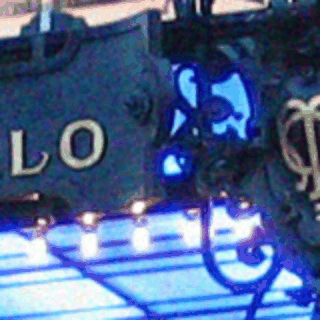
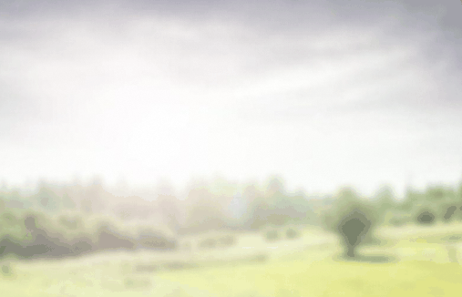

# Pixel-Aware Stable Diffusion for Realistic Image Super-Resolution and Personalized Stylization

[Paper](https://arxiv.org/abs/2308.14469)

[Tao Yang](https://cg.cs.tsinghua.edu.cn/people/~tyang)<sup>1</sup>, Peiran Ren<sup>1</sup>, Xuansong Xie<sup>1</sup>, [Lei Zhang](https://www4.comp.polyu.edu.hk/~cslzhang)<sup>2</sup>  
_<sup>1</sup>[DAMO Academy, Alibaba Group](https://damo.alibaba.com), Hangzhou, China_  
_<sup>2</sup>[Department of Computing, The Hong Kong Polytechnic University](http://www.comp.polyu.edu.hk), Hong Kong, China_

## Our model can do various tasks. Hope you can enjoy it.

## Realistic Image SR
 

## Old photo restoration
 

 

## Personalized Stylization
 

## Colorization
 

## News
(2023-09-12) Add Gradio demo.

(2023-09-11) Upload pre-trained models.

(2023-09-07) Upload source codes.

## Usage
- Clone this repository:
```bash
git clone https://github.com/yangxy/PASD.git
cd PASD
```

- Download SD1.5 models from [huggingface](https://huggingface.co/runwayml/stable-diffusion-v1-5) and put them into ``checkpoints/stable-diffusion-v1-5``. 

- Prepare training datasets. Please check ``dataloader/localdataset.py`` and ``dataloader/webdataset.py`` carefully and set the paths correctly. We highly recommend to use ``dataloader/webdataset.py``.

- Train a PASD.
```bash
bash ./train_pasd.sh
```
if you want to train pasd_light, use ``--use_pasd_light``.

- Test PASD.

Download our pre-trained models [pasd](https://public-vigen-video.oss-cn-shanghai.aliyuncs.com/robin/models/PASD/pasd.zip) | [pasd_rrdb](https://public-vigen-video.oss-cn-shanghai.aliyuncs.com/robin/models/PASD/pasd_rrdb.zip) | [pasd_light](https://public-vigen-video.oss-cn-shanghai.aliyuncs.com/robin/models/PASD/pasd_light.zip) | [pasd_light_rrdb](https://public-vigen-video.oss-cn-shanghai.aliyuncs.com/robin/models/PASD/pasd_light_rrdb.zip), and put them into ``runs/``. 

```bash
python test_pasd.py # --use_pasd_light --use_personalized_model
```
Please read the arguments in ``test_pasd.py`` carefully. We adopt the tiled vae method proposed by [multidiffusion-upscaler-for-automatic1111](https://github.com/pkuliyi2015/multidiffusion-upscaler-for-automatic1111) to save GPU memory.

Please try ``--use_personalized_model`` for personalized stylizetion, old photo restoration and real-world SR. Set ``--conditioning_scale`` for different stylized strength. 

We use personalized models including [majicMIX realistic](https://civitai.com/models/43331/)(for SR and restoration), [ToonYou](https://civitai.com/models/30240/)(for stylization) and [modern disney style](https://huggingface.co/nitrosocke/mo-di-diffusion)(``unet`` only, for stylization). You can download more from communities and put them into ``checkpoints/personalized_models``.

If the default setting does not yield good results, try different ``--pasd_model_path``, ``--seed``, ``--prompt``, ``--upscale``, or ``--high_level_info`` to get better performance.

- Gradio Demo
```bash
python gradio_pasd.py
```

## Citation
If our work is useful for your research, please consider citing:

    @inproceedings{yang2023pasd,
	    title={Pixel-Aware Stable Diffusion for Realistic Image Super-Resolution and Personalized Stylization},
	    author={Tao Yang, Peiran Ren, Xuansong Xie, and Lei Zhang},
	    booktitle={Arxiv},
	    year={2023}
    }
    
## License
© Alibaba, 2023. For academic and non-commercial use only.

## Acknowledgments
Our project is based on [diffusers](https://github.com/huggingface/diffusers).

## Contact
If you have any questions or suggestions about this paper, feel free to reach me at yangtao9009@gmail.com.